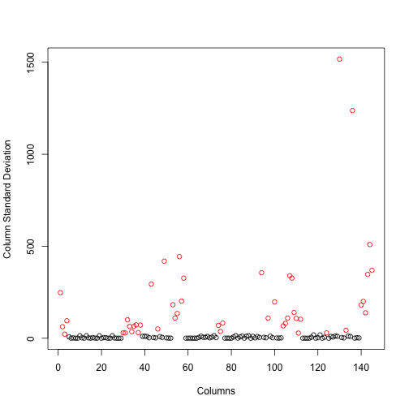

## Prediction of Human Activities
#### P. Angzh

### Project Description

The goal of the project is to predict the type of exercises
a person carried out using the data recorded from accelerometers
on the belt, forearm, arm, and dumbell of 6 participants.
They were asked to perform barbell lifts correctly and incorrectly
in 5 different ways. 

The training data for this project are available here: 

https://d396qusza40orc.cloudfront.net/predmachlearn/pml-training.csv

The test data are available here: 

https://d396qusza40orc.cloudfront.net/predmachlearn/pml-testing.csv

The "classe" variable in the training set recorded the five
types of exercises, A, B, C, D, and E, corresponding to
the five different ways respectively.

### Exploratory Analysis

The data sets were pre-downloaded from the above sources to
the working directory and read into R with the following codes.
A quick check of the data, for example, doing a scatterplot
on values of each column (codes not shown), identified a dozen
or so columns that can be excluded (they basically contained all NAs).


```r
pml.trn = read.csv("pml-training.csv", na.strings=c("#DIV/0!", "NA"))
pml.tst = read.csv("pml-testing.csv", na.strings=c("#DIV/0!", "NA"))
# Exploratory analysis identified the following columns with bad data
# basically they contain all NAs
exclude = c(1, 2, 3, 4, 5, 14, 17, 26, 36, 89, 92, 127, 130)
pml.trn = pml.trn[, -exclude]
pml.tst = pml.tst[, -exclude]
```
### Data Cleaning

First, NAs, if any, were converted to 0's because NAs would cause errors
for trainding models. Then the columns that showed little variations
(red points in Fig. 1)
were removed as columns with little variations would contribute little
to the training and predicting.


```r
cutoff = 20
pml.trn[is.na(pml.trn)] = 0
pml.tst[is.na(pml.tst)] = 0
exc = numeric(0)
sds = numeric(0)
idx = 0
for(col in names(pml.trn)){
    idx = idx + 1 
    if(class(pml.trn[, col]) == 'factor') {
        if(col != 'classe'){
            exc = c(exc, idx)
        }
    }
    else {
        s = sd(pml.trn[, col])
        if(s < cutoff){
            exc = c(exc, idx)
        }
        sds = c(sds, s)
    }
}
pml.trn = pml.trn[, -exc]
pml.tst = pml.tst[, -exc]
labels = (sds >= cutoff)*1 + 1
plot(sds, xlab = "Columns", ylab="Column Standard Deviation", col=labels)
```

 
<center><h4>Fig. 1: Standard Deviations of Column Values. Columns with s.d. above the cutoff values are shown in red.</h5></center>

### Training and Cross Validation

The training data set was partitioned into two parts, one for training and
one for cross validataion.  The package caret was used for the
training and prediction.
Five classification models were chosen for the training.
The accuracies or error rates of the trained models were
estimated on the validation data and
confusion matrixes were created for assessment
(one from the <b>random forest (rf)</b> model was shown as an example).

```r
library(caret)
set.seed(135)
inTrain = createDataPartition(y = pml.trn$classe, p = 0.7, list = FALSE)
training = pml.trn[inTrain,]    # for training per se
testing =  pml.trn[-inTrain,]   # for cross validation
rm(pml.trn)   # release memory
seed = 357
models = c('rf', 'rpart', 'rpart2', 'lda', 'mda', 'amdai', 'slda')
fits = list()
idx = 0
for(model in models){
  idx = idx + 1
  if(length(fits) < idx || is.null(fits[[idx]])){
    set.seed(seed)
    fits[[idx]] = train(classe ~ ., method = model, data = training)
  }
}
validates = data.frame()
for(i in 1:idx){
  model = fits[[i]]$method
  rslt = predict(fits[[i]], newdata = testing)
  evals = (rslt == testing$classe)
  validates = rbind(validates, data.frame(model = model, accuracy = mean(evals)))
}
validates
```

```
##    model  accuracy
## 1     rf 0.9984707
## 2  rpart 0.5158879
## 3 rpart2 0.6533560
## 4    lda 0.6888700
## 5  amdai 0.6888700
## 6   slda 0.4932880
## 7   slda 0.4932880
```

```r
confusionMatrix(predict(fits[[1]], newdata=testing), testing$classe)
```

```
## Confusion Matrix and Statistics
## 
##           Reference
## Prediction    A    B    C    D    E
##          A 1674    1    0    0    0
##          B    0 1136    2    0    1
##          C    0    1 1024    1    0
##          D    0    1    0  963    2
##          E    0    0    0    0 1079
## 
## Overall Statistics
##                                           
##                Accuracy : 0.9985          
##                  95% CI : (0.9971, 0.9993)
##     No Information Rate : 0.2845          
##     P-Value [Acc > NIR] : < 2.2e-16       
##                                           
##                   Kappa : 0.9981          
##  Mcnemar's Test P-Value : NA              
## 
## Statistics by Class:
## 
##                      Class: A Class: B Class: C Class: D Class: E
## Sensitivity            1.0000   0.9974   0.9981   0.9990   0.9972
## Specificity            0.9998   0.9994   0.9996   0.9994   1.0000
## Pos Pred Value         0.9994   0.9974   0.9981   0.9969   1.0000
## Neg Pred Value         1.0000   0.9994   0.9996   0.9998   0.9994
## Prevalence             0.2845   0.1935   0.1743   0.1638   0.1839
## Detection Rate         0.2845   0.1930   0.1740   0.1636   0.1833
## Detection Prevalence   0.2846   0.1935   0.1743   0.1641   0.1833
## Balanced Accuracy      0.9999   0.9984   0.9988   0.9992   0.9986
```
### Prediction on the Assignment Testing Data.
From the cross validation results, it's obvious that the random forest
model gave the best performence (in terms of accuracy; it took the longest
time to train). So the trained <b>rf</b> model was used 
to predict the 20 assignment data with an expected accuracy rate being over 99%.
The actual accuracy rate was 100% upon submission!


```r
predict(fits[[1]], newdata = pml.tst)
```

```
##  [1] B A B A A E D B A A B C B A E E A B B B
## Levels: A B C D E
```
